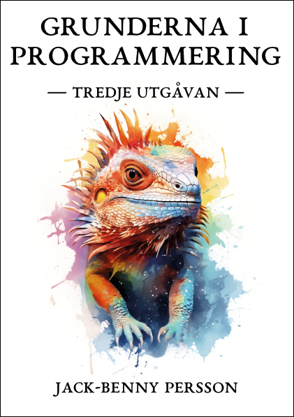

# Grunderna i programmering (tredje utgåvan)
Här finner du all exempelkod för **Grunderna i programmering** (tredje
utgåvan) (ISBN: 978-91-987815-1-9).

Mer information om boken finns hos [CyberInfo
Sverige](https://www.cyberinfo.se/bocker/). 

Boken går att köpa från
[Bokus](https://www.bokus.com/bok/9789198781519/grunderna-i-programmering/)
och
[Adlibris](https://www.adlibris.com/se/bok/grunderna-i-programmering-9789198781519)
från och med mitten av mars 2024.

Är du nyfiken på boken så titta gärna i
[innehållsförteckningen](https://www.cyberinfo.se/dokument/gip_innehallsforteckning_3e_utg.html).

## Baksidetexten
**Grunderna i programmering** lär oss allt vi behöver för att komma igång med
programmering på egen hand. Vi börjar med att utforska Scratch för att få en
visuell upplevelse för programmering. Här lär vi oss om exempelvis kodblock,
if-satser och variabler. Vi får också se hur Scratch och Pythonkod liknar
varandra.  Därefter går vi vidare med en introduktion av hur datorn fungerar,
hur vi skriver kod i en textredigerare, hur kod tolkas och körs på datorn.

Nu kastar vi oss in i programmerings värld och börjar programmera i Python,
som är bokens huvudinnehåll. Vi lär oss allt om if-satser, loopar,
standardbiblioteket, felhantering, filhantering, match-satser och mycket mer.

I boken finns över 70 kompletta kodexempel som vi lär oss av. Alla kodexemplen
förklaras och dess utdata visas i boken. På så sätt går det att läsa boken i
soffan, i sängen eller på bussen, utan tillgång till en dator.

Efter varje kapitel finns övningsuppgifter av varierad svårighetsgrad. Boken
går därför utmärkt att använda både för egenstudier, i studiegrupper eller i
klassrum.

I tredje utgåvan har boken uppdaterats för Python 3.12, nya sätt att
installera Python i Microsoft Windows, macOS och nyare versioner av Linux. Nya
stycken har också tillkommit om bland annat match/case, signalhantering,
datumhantering, nyckelordet finally och avrundning av flyttal. Språket i boken
har också förtydligats.

## Framsidan

